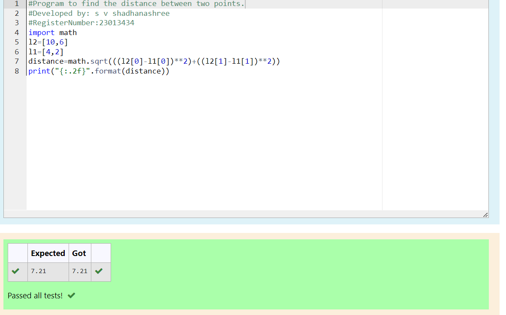

# DISTANCE-BETWEEN-TWO-POINTS

## AIM:
To write a python program to find the distance two 2 points
## ALGORITHM:
### Step 1: 
Start the program
### Step 2: 
Write the program appropriately
### Step 3: 
Substitute the values in the distance formula  
### Step 4: 
Use the Distance formula 
### Step 5: 
Run the Program
### PROGRAM:
```
#Program to find the distance between two points.
#Developed by: s v shadhanashree
#RegisterNumber:23013434
import math
l2=[10,6]
l1=[4,2]
distance=math.sqrt(((l2[0]-l1[0])**2)+((l2[1]-l1[1])**2))
print("{:.2f}".format(distance))
```
  ### OUTPUT:



### RESULT:
Thus the Distance between two points is executed successfully
